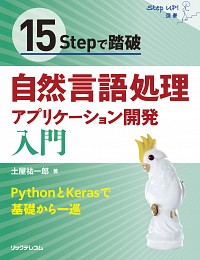

# 自然言語処理を学習する

## 書籍情報
* [15Stepで踏破 自然言語処理アプリケーション開発入門](http://www.ric.co.jp/book/contents/book_1132.html)  

## サンプルデータ
`dialogue_agent_data` フォルダに格納されています。  
対話エージェントを作成する例題で使用する学習データ、テストデータです。  

## 実行環境について
執筆環境をDockerで再現するための`Dockerfile`と、ビルド時に使用する`requirements.txt`です。  
Dockerを使わず環境構築する場合でも、`requirements.txt`は利用できる。  

## サンプルコード
`src` フォルダに格納されています。  
サンプルコードの抜粋や、サンプルコード中で参照されるファイルです。  

以上